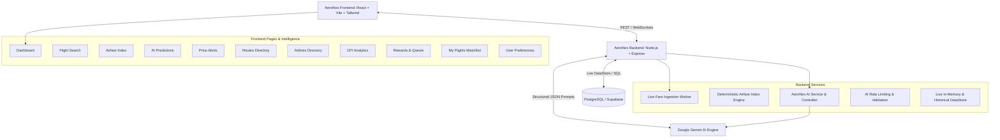

# AeroNex — Real-Time Airfare Intelligence
> **FLY BEYOND LIMITS**

A production-ready SaaS aviation intelligence platform for tracking, analyzing, and predicting airfare prices across Indian aviation networks using Supabase and Google Gemini AI.

## System Architecture



## Setup Instructions

### 1. Installation
Install frontend dependencies:
```bash
npm install
```

Install backend dependencies:
```bash
cd server
npm install
```

### 2. Environment Variables
In the `server/` directory, copy `.env.example` to `.env` and fill in your credentials:
```env
PORT=5000
SUPABASE_URL=your_supabase_url
SUPABASE_SERVICE_ROLE_KEY=your_supabase_service_role_key
GEMINI_API_KEY=your_gemini_api_key
AI_MODEL=gemini-2.5-flash
AI_RATE_LIMIT_PER_MINUTE=30
AI_INSIGHT_CACHE_MINUTES=30
DATA_REFRESH_INTERVAL_SECONDS=30
```

*Note: If Supabase or Gemini credentials are not provided, the server automatically operates in high-fidelity Demo Mode with deterministic algorithms and simulated live market fluctuations.*

### 3. Running Locally
Run the backend API (from the `server/` directory):
```bash
npm run dev
```

Run the frontend Vite server (from the root directory):
```bash
npm run dev
```

Navigate to `http://localhost:5173/dashboard` to view the application.

## Server-Side AI Architecture
The `server/src/services/aiService.ts` module isolates all Google Gemini operations on the backend. No API keys are ever leaked to the client bundle. All incoming prompts are validated with Zod schemas, cached in-memory to prevent API abuse, and grounded in real database analytics.
