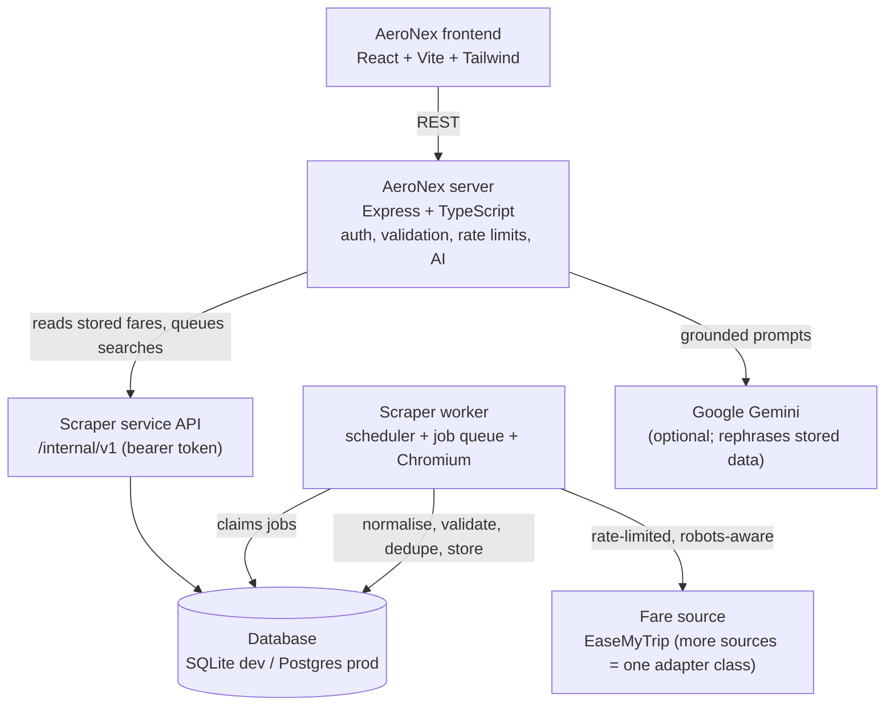

# AeroNex — Airfare Intelligence
> **FLY BEYOND LIMITS**

Tracks, analyses and explains Indian domestic airfares. Fares are **collected by a scraper service**, validated,
stored with full price history, and served to the dashboard with an honest freshness label. Nothing on screen is
generated: every airfare number traces back to a stored, timestamped observation.

## System architecture


```mermaid
graph TD
    UI["AeroNex frontend<br/>React + Vite + Tailwind"]
    API["AeroNex server<br/>Express + TypeScript<br/>auth, validation, rate limits, AI"]
    SVC["Scraper service API<br/>/internal/v1 (bearer token)"]
    WRK["Scraper worker<br/>scheduler + job queue + Chromium"]
    SRC["Fare source<br/>EaseMyTrip (more sources = one adapter class)"]
    DB[("Database<br/>SQLite dev / Postgres prod")]
    AI["Google Gemini<br/>(optional; rephrases stored data)"]

    UI -->|"REST"| API
    API -->|"reads stored fares, queues searches"| SVC
    SVC --> DB
    WRK -->|"claims jobs"| DB
    WRK -->|"rate-limited, robots-aware"| SRC
    WRK -->|"normalise, validate, dedupe, store"| DB
    API -->|"grounded prompts"| AI
```

| Piece | Where | Runs as |
|---|---|---|
| Frontend | `src/` | static site (Vercel) |
| AeroNex server | `server/` | Node process (auth, AI, alerts, proxy to the scraper) |
| Scraper service + worker | `C:\Users\itzsh\AeroNex\Backend` (its own repo) | **persistent** Python processes with Chromium - not serverless |
| Database | scraper DB (`AERONEX_DB` / `DATABASE_URL`); Supabase for accounts | SQLite locally, Postgres in production |

The browser never scrapes and never sees the scraper's address or token. See [docs/API.md](docs/API.md) for the
AeroNex API and the scraper repo's `Backend/docs/API.md` for the service API. Deployment: [DEPLOYMENT.md](DEPLOYMENT.md).

## Run everything locally

Prerequisites: Node 20+, Python 3.11+, Chrome/Chromium for Playwright (`playwright install chromium`).

```bash
# 1. install
npm install && (cd server && npm install)
(cd ../AeroNex/Backend && pip install -r requirements-dev.txt && playwright install chromium)

# 2. configure (copy the examples; see the comments in each file)
cp .env.example .env && cp server/.env.example server/.env
# server/.env:  SCRAPER_API_URL=http://127.0.0.1:8000   SCRAPER_API_TOKEN=<same token as the scraper>

# 3. start the four processes (or run scripts/dev-all.ps1 on Windows)
(cd ../AeroNex/Backend && python run_worker.py)          # scheduler + job queue + browser
(cd ../AeroNex/Backend && python run_api.py 8000)        # scraper service API
(cd server && npm run dev)                               # AeroNex server on :5000
npm run dev                                              # frontend on :5173
```

The first scheduled cycle takes about a minute (24 searches). Until then the app says "No data yet" instead of showing
numbers. To collect immediately: `python run_worker.py --once`.

### Tests, build, lint

```bash
npm run build && npm run lint && npx tsc -b            # frontend
(cd server && npm test && npx tsc --noEmit)            # server: AI, app/auth, scraper-integration tests
(cd ../AeroNex/Backend && pytest)                      # scraper: 160+ tests, no network
```

## Environment variables

| Where | Variable | Purpose |
|---|---|---|
| server | `SCRAPER_API_URL`, `SCRAPER_API_TOKEN` | the scraper service (server-side only; **never** `VITE_`-prefixed) |
| server | `SCRAPER_POLL_SECONDS` | how often the server re-reads the scraper (default 30) |
| server | `ADMIN_EMAILS` | who may start a manual scrape. Empty in production = nobody |
| server | `ALLOW_SIMULATED_DATA` | development aid only; simulated fares are refused in production unless `true` |
| server | `SUPABASE_URL`, `SUPABASE_SERVICE_ROLE_KEY` | verify user sessions (service role, server-side only) |
| server | `CORS_ORIGINS`, `TRUST_PROXY` | allowed browser origins; reverse-proxy hops for rate limiting |
| server | `GEMINI_API_KEY`, `AMADEUS_*` | optional AI / alternative real fare source |
| frontend | `VITE_API_BASE_URL` | the AeroNex server URL |
| frontend | `VITE_SUPABASE_URL`, `VITE_SUPABASE_ANON_KEY` | public Supabase values (RLS must be enabled) |
| frontend | `VITE_ALLOW_SIMULATION` | demo deployments only; production builds otherwise show "no data source" without a server |
| scraper | see `Backend/.env.example` | DB, token, routes, cadence, rate limits |

## Data honesty

`GET /api/data-status` says where fares come from and how old they are; every LIVE badge is driven by it.

| State | When | UI |
|---|---|---|
| `live` | newest successful scrape is younger than 1.5 x the schedule interval | **LIVE · updated N min ago** |
| `delayed` / `stale` | older than that / older than 3 h | **DELAYED** / **STALE** |
| `unavailable` | the scraper has collected nothing yet | **NO DATA YET** |
| `unconfigured` | no fare source configured (production) | **NO DATA SOURCE** |
| `simulated` | development only, no real source configured | **SIMULATED** |
| offline | this server cannot be reached | **OFFLINE** |

"Live" means *recently collected from the source*, never a stream. The dashboard only changes when the scraper stores
a **newer** snapshot. The dashboard index is computed from stored observations (method described at
`GET /api/air-price-index`), not from hard-coded baselines.

Still static reference data (and labelled as such on the page): CPI analytics, the airlines directory and the
methodology page. They are not airfare observations.

## Security model
* All user data (`/api/user/*`, alerts, notifications, pipeline status) requires a valid Supabase session token or personal
  API key; the user is taken from the verified token, never from request fields.
* Manual scrapes cost real requests against a third-party site, so only `ADMIN_EMAILS` may start them.
* Secrets stay on the servers. Only the Supabase anon key is bundled in the browser, so **Row Level Security must be
  enabled**: apply `server/supabase/migrations/003_secure_rls.sql` (earlier migrations granted public read/write on every table).
* CORS is restricted to `CORS_ORIGINS`; requests are rate limited; error responses never include stack traces or upstream text.
* The scraper API requires a bearer token and refuses to start in production without one; logs redact credentials.

## Server-side AI
`server/src/services/aiService.ts` isolates all Gemini operations on the server. Analysis is computed
deterministically from stored fares (trend, volatility, range, confidence that reflects how much history exists); Gemini,
when configured, only rephrases that data. Responses separate *observed data* from *AI analysis* and list the data used and
the caveats.

This project is meant for SIH purposes.
