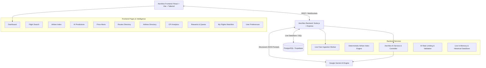

# AeroNex — Real-Time Airfare Intelligence
> **FLY BEYOND LIMITS**

A production-ready SaaS aviation intelligence platform for tracking, analyzing, and predicting airfare prices across Indian aviation networks using Supabase and Google Gemini AI.

## System Architecture


```mermaid
graph TD
    Client[AeroNex Frontend: React + Vite + Tailwind]
    API[AeroNex Backend: Node.js + Express]
    DB[(PostgreSQL / Supabase)]
    AI[Google Gemini AI Engine]

    Client <-->|REST / WebSockets| API
    API <-->|Live DataStore / SQL| DB
    API <-->|Structured JSON Prompts| AI

    subgraph "Frontend Pages & Intelligence"
        Dashboard
        FlightSearch[Flight Search]
        AirfareIndex[Airfare Index]
        Predictions[AI Predictions]
        PriceAlerts[Price Alerts]
        RoutesPage[Routes Directory]
        AirlinesPage[Airlines Directory]
        CPIAnalytics[CPI Analytics]
        Gamification[Rewards & Quests]
        MyFlights[My Flights Watchlist]
        Settings[User Preferences]
    end

    subgraph "Backend Services"
        IngestionWorker[Live Fare Ingestion Worker]
        IndexEngine[Deterministic Airfare Index Engine]
        aiService[AeroNex AI Service & Controller]
        rateLimit[AI Rate Limiting & Validation]
        liveDataStore[Live In-Memory & Historical DataStore]
    end

    Client --> Dashboard
    API --> IngestionWorker
    API --> aiService
    aiService --> AI
```

## Setup Instructions

### 1. Installation
Install frontend dependencies:
```bash
npm install
```

Install backend dependencies:
```bash
cd server
npm install
```

### 2. Environment Variables
Copy `.env.example` (frontend) to `.env` and `server/.env.example` to `server/.env`, then fill in your credentials. See the comments in each file; the essentials are:

```env
# server/.env
SUPABASE_URL=...                     # used to verify user sessions (service role, server-side only)
SUPABASE_SERVICE_ROLE_KEY=...
CORS_ORIGINS=https://your-frontend   # browser origins allowed to call the API
GEMINI_API_KEY=...                   # optional; without it AI answers use deterministic analytics
AMADEUS_CLIENT_ID=... / AMADEUS_CLIENT_SECRET=...   # optional; enables REAL market fares

# .env (frontend)
VITE_SUPABASE_URL=...
VITE_SUPABASE_ANON_KEY=...
VITE_API_BASE_URL=http://localhost:5000
```

### Data honesty: live vs simulated
AeroNex never presents modelled numbers as live. The server reports where fares come from at `GET /api/data-status`, and every "Live" indicator in the UI is driven by it:

| Mode | When | UI badge |
| --- | --- | --- |
| `live` | Amadeus credentials configured and the last refresh is recent | **LIVE** |
| `simulated` | No real fare source configured (default) | **SIMULATED** |
| stale / unreachable | Last refresh is older than 3 intervals, or the API cannot be reached | **DELAYED** / **OFFLINE** |

The Amadeus provider (`server/src/providers/AmadeusAirfareProvider.ts`) is implemented but has not been exercised against the live service in this repository (no credentials were available). Flight-search schedules are an indicative model anchored to observed corridor fares; AeroNex does not have live seat inventory.

### Security model
* All user data (`/api/user/*`, alerts, notifications, pipeline) requires a valid Supabase session token or personal API key; the user is taken from the verified token, never from request fields.
* Secrets stay on the server. Only the Supabase anon key is bundled in the browser, so **Row Level Security must be enabled**: apply `server/supabase/migrations/003_secure_rls.sql` (the earlier migrations granted public read/write on every table).
* CORS is restricted to `CORS_ORIGINS`; requests are rate limited; error responses never include stack traces.

### 3. Running Locally
Run the backend API (from the `server/` directory):
```bash
npm run dev
```

Run the frontend Vite server (from the root directory):
```bash
npm run dev
```

Navigate to `http://localhost:5173/dashboard` to view the application.

## Server-Side AI Architecture
The `server/src/services/aiService.ts` module isolates all Google Gemini operations on the backend. No API keys are ever leaked to the client bundle. All incoming prompts are validated with Zod schemas, cached in-memory to prevent API abuse, and grounded in real database analytics.

This Project is meant for SIH purpose.
