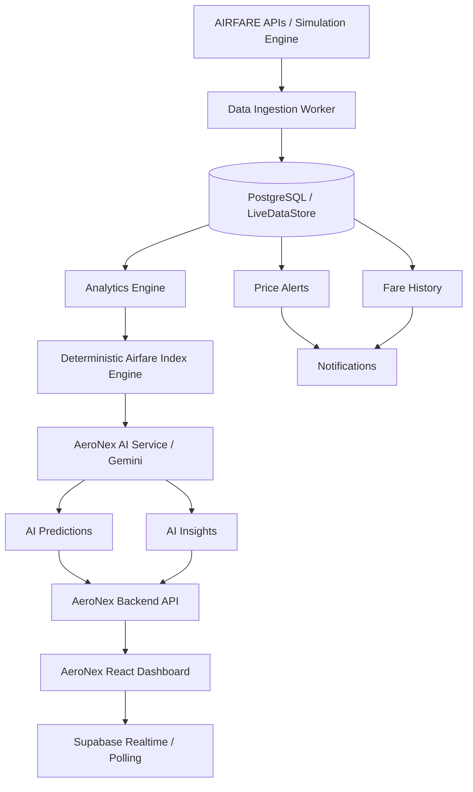

# AeroNex Architecture
> **FLY BEYOND LIMITS**

## System Design

## Data Ingestion & Analytics Flow
The backend uses a `dbService` layer that can switch between an active Supabase provider and a local Demo provider (to run without cloud setup).
When airfare data is ingested, it calculates indices like `Airfare Index` and regional fluctuations.
The `aiService` then queries these aggregated metrics and asks Gemini to generate human-readable insights, which are cached with a configurable TTL to prevent unnecessary API usage.
